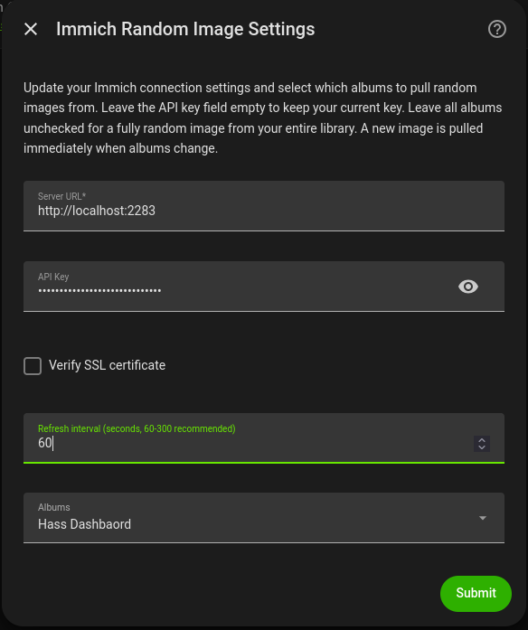
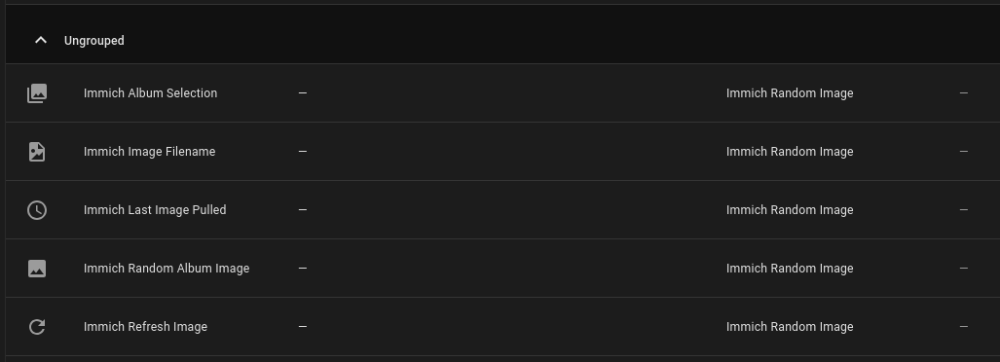
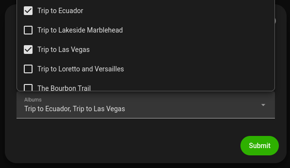
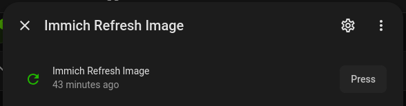

# Immich Random Image for Home Assistant


I got tired of old Home Assistant add-ons that would break when Immich updated their APIs, so I created a custom integration for Home Assistant that displays random images from your Immich instance on your dashboards. Built for Immich v3+ using the current `/api/search/random` endpoint.

> **Looking for the original integration?** The previous [immich-home-assistant](https://github.com/outadoc/immich-home-assistant) integration by [@outadoc](https://github.com/outadoc) broke when Immich changed their API in v3. This is a fresh, from-scratch implementation using the current `/api/search/random` endpoint — not a fork or patch.

## Screenshots

| Configuration | Entities |
|---|---|
|  |  |

| Album Selection | Refresh on Demand |
|---|---|
|  |  |

## Features

- **Fully random image** from your entire Immich library
- **Random image from a specific album** — select one album in options
- **Random image from multiple albums** — select multiple albums; the integration picks randomly across all of them
- **SSL toggle** — disable SSL verification for self-hosted instances without valid certificates
- **URL normalization** — handles `localhost`, `127.0.0.1`, private IPs, bare hostnames, and full domain names
- **Configurable refresh interval** — new image every 5 minutes by default; adjustable from 1 second to 24 hours (60-300 seconds recommended)
- **No external dependencies** — uses only `aiohttp` (bundled with Home Assistant)

## Entities

The integration creates the following entities:

| Entity | Type | Purpose |
|---|---|---|
| `image.immich_random_image` | Image | Displays the current random image |
| `sensor.immich_last_image_pulled` | Sensor | Timestamp of when the last image was fetched |
| `sensor.immich_image_filename` | Sensor | Filename of the current image (with dimensions and date as attributes) |
| `button.immich_refresh_image` | Button | Triggers a manual refresh — fetches a new random image immediately |
| `select.immich_album_selection` | Select | Dynamically change album selection from automations |

## Services

### `immich_random.refresh`

Manually trigger a new random image fetch. Optionally target a specific config entry.

```yaml
# Refresh all Immich Random Image entries
action: immich_random.refresh

# Refresh a specific entry
action: immich_random.refresh
data:
  entry_id: "01M0E6XHB0J5E8M80BGZ3ZFYSF"
```

## Automation Examples

### Change album based on time of day

```yaml
alias: "Rotate album by time of day"
trigger:
  - platform: time
    at: "07:00:00"
    id: morning
  - platform: time
    at: "19:00:00"
    id: evening
action:
  - choose:
      - conditions:
          - condition: trigger
            id: morning
        sequence:
          - action: select.select_option
            target:
              entity_id: select.immich_album_selection
            data:
              option: "67e7960d-4dae-45e0-85d8-9ee70441910f"  # Hass Dashboard album
      - conditions:
          - condition: trigger
            id: evening
        sequence:
          - action: select.select_option
            target:
              entity_id: select.immich_album_selection
            data:
              option: "all"  # Random from entire library
```

### Refresh image on motion

```yaml
alias: "Refresh image when motion detected"
trigger:
  - platform: state
    entity_id: binary_sensor.living_room_motion
    to: "on"
action:
  - action: button.press
    target:
      entity_id: button.immich_refresh_image
```

## Installation

Install via [HACS](https://hacs.xyz) (Home Assistant Community Store).

[](https://my.home-assistant.io/redirect/hacs_repository/?repository=ha-random-immich&category=Integration&owner=strickdd)

1. Click the button above, or open HACS → Integrations → ⋮ → Custom repositories
2. Add `https://github.com/strickdd/ImmichRandomImage` as an Integration repository
3. Install "Immich Random Image" from HACS
4. Restart Home Assistant

## Immich API Key Setup

To use this integration, you need a long-lived API key from Immich:

1. Open your Immich web UI
2. Go to **Settings → API Keys** (or **Account Settings → API Keys**)
3. Click **Create new API key**
4. Give it a name (e.g. "Home Assistant")
5. Copy the generated key

### Required permissions

The API key needs the following Immich permissions:

| Permission | Why |
|---|---|
| `album.read` | List albums for the album picker (optional — only needed if selecting specific albums) |
| `asset.read` | Download image originals |
| `search.read` | Use the `/api/search/random` endpoint |

You do **not** need `user.read` or any admin-level permissions. The integration authenticates via `/api/auth/validateToken`, which requires no special permissions.

If your key is missing a permission, Immich returns `403 Missing required permission: <permission>`. Add the missing permission to the key in Immich settings and try again.

## Configuration

[](https://my.home-assistant.io/redirect/config_flow_start/?domain=immich_random)

1. Click the button above, or go to **Settings → Devices & Services → Add Integration**
2. Search for "Immich Random Image"
3. Enter your Immich server URL and API key
   - Toggle SSL verification off if your self-hosted instance uses self-signed certificates
4. After setup, click **Configure** on the integration to select which albums to pull from
   - Leave all albums unchecked for a fully random image from your entire library
   - Select one album for random images from that album only
   - Select multiple albums for random images across all selected albums

## Usage

Add the entity to your dashboard using a Picture card or Picture Entity card:

```yaml
type: picture-entity
entity: image.immich_random_album_image
show_state: false
show_name: false
aspect_ratio: "16:9"
fit_mode: contain
```

Or use it as a dashboard background image:

```yaml
type: picture
image_entity: image.immich_random_album_image
```

The entity refreshes every 5 minutes with a new random image. State attributes include `media_filename`, `media_localdatetime`, `media_width`, and `media_height`.

## How it works

The integration uses Immich's `/api/search/random` endpoint (introduced in Immich v3) to request a single random image, optionally filtered by album IDs. It then downloads the original full-resolution image and serves it as a standard Home Assistant `image` entity. No asset ID caching or listing is needed — the random endpoint handles selection server-side.

## Requirements

- Home Assistant 2024.1+ (tested on 2026.8.0)
- Immich v3+ running and accessible from your Home Assistant instance
- A long-lived Immich API key with `asset.read` and `search.read` permissions

## Development

```bash
# Install dev dependencies
pip install -r requirements-dev.txt

# Run tests
python -m pytest tests/ -v

# Run linting
ruff check custom_components/
```

## License

MIT
